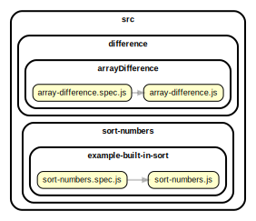

<!-- BEGIN TITLE -->

# DOCS

<!-- END TITLE -->

<!-- BEGIN TREE -->

> [interactive graph](./dependency-graph.html)



<!-- END TREE -->

<!-- BEGIN TOC -->

- deep-flat
  - deepflat-daniel
    - [deepflat-daniel.js](#srcdeep-flatdeepflat-danieldeepflat-danieljs)
- difference
- intersection
- sort-numbers
  - example-built-in-sort
    - [sort-numbers.js](#srcsort-numbersexample-built-in-sortsort-numbersjs)
- split-object
  - split-object-daniel
    - [split-object-daniel.js](#srcsplit-objectsplit-object-danielsplit-object-danieljs)

---

<!-- END TOC -->

---

<!-- BEGIN DOCS -->

# /deep-flat

## /deepflat-daniel

<details><summary><a href="../../src/deep-flat/deepflat-daniel/deepflat-daniel.js" id="srcdeep-flatdeepflat-danieldeepflat-danieljs">../src/deep-flat/deepflat-daniel/deepflat-daniel.js</a></summary>

<a name="deepFlatDaniel"></a>

## deepFlatDaniel ⇒ <code>Array</code>

Converts a nested array into a single array with no nesting.

It returns a new array and there are no side-effects.

**Returns**: <code>Array</code> - Returns the new flattened array.

| Param   | Type               | Default         | Description           |
| ------- | ------------------ | --------------- | --------------------- |
| [array] | <code>Array</code> | <code>[]</code> | The array to flatten. |

**Example**

```js
deepFlat([1, [2, [3, [4]], 5]]);
// -> [1, 2, 3, 4, 5]
```

**Example**

```js
deepFlat(["a", ["b", [["c"], ["d"]], "e"]]);
// -> ['a', 'b', 'c', 'd', 'e']
```

</details>

---

---

# /difference

---

# /intersection

---

# /sort-numbers

## /example-built-in-sort

<details><summary><a href="../../src/sort-numbers/example-built-in-sort/sort-numbers.js" id="srcsort-numbersexample-built-in-sortsort-numbersjs">../src/sort-numbers/example-built-in-sort/sort-numbers.js</a></summary>

<a name="sortNumbers"></a>

## sortNumbers ⇒ <code>Array.&lt;number&gt;</code>

Sorts an array of numbers from smallest to largest.

Returns a new array without modifying the original array.

Does not need to support: NaN, Infinity, -Infinity.

**Returns**: <code>Array.&lt;number&gt;</code> - A new array with the same numbers, but sorted.

| Param          | Type                              | Default         | Description                   |
| -------------- | --------------------------------- | --------------- | ----------------------------- |
| [arrOfNumbers] | <code>Array.&lt;number&gt;</code> | <code>[]</code> | The array of numbers to sort. |

**Example**

```js
sortNumbers([1.5, 1, -1.5, 0, -1]);
// -> [-1.5, -1, 0, 1, 1.5]
```

**Example**

```js
sortNumbers([-1, 0, 1]);
// -> [-1, 0, 1]
```

</details>

---

---

# /split-object

## /split-object-daniel

<details><summary><a href="../../src/split-object/split-object-daniel/split-object-daniel.js" id="srcsplit-objectsplit-object-danielsplit-object-danieljs">../src/split-object/split-object-daniel/split-object-daniel.js</a></summary>

<a name="splitObjectDaniel"></a>

## splitObjectDaniel ⇒ <code>Array</code>

Splits an object into multiple objects with one key/value pair each.
The new objects are returned in an array.

This function has no side-effects, the argument object is not modified

**Returns**: <code>Array</code> - Returns a new array with one entry for each key/value pair.

| Param        | Type                | Default         | Description                               |
| ------------ | ------------------- | --------------- | ----------------------------------------- |
| [toSeparate] | <code>Object</code> | <code>{}</code> | The object to split into key/value pairs. |

**Example**

```js
splitObject({ a: 1, b: 2, c: 3 });
// -> [{ a: 1 }, { b: 2 }, { c: 3 }]
```

**Example**

```js
splitObject({ name: "robs", age: 25, tall: true, userName: "sbor" });
// -> [{ name: 'robs }, { age: 25 }, { tall: true }, { userName: 'sbor' }]
```

**Example**

```js
splitObject({});
// -> []
```

</details>

---

---

<!-- END DOCS -->
